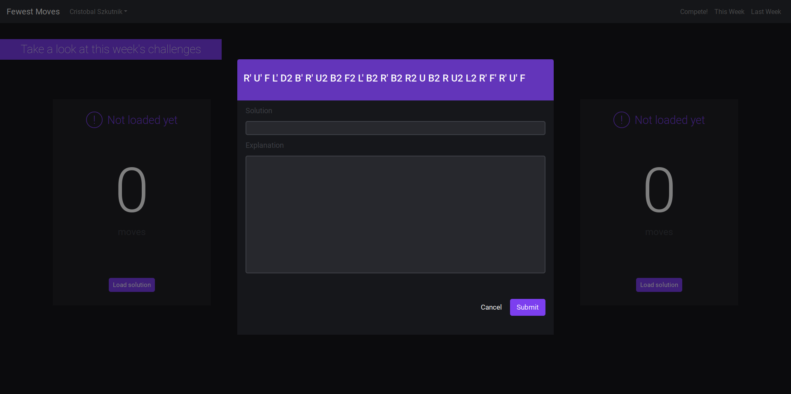
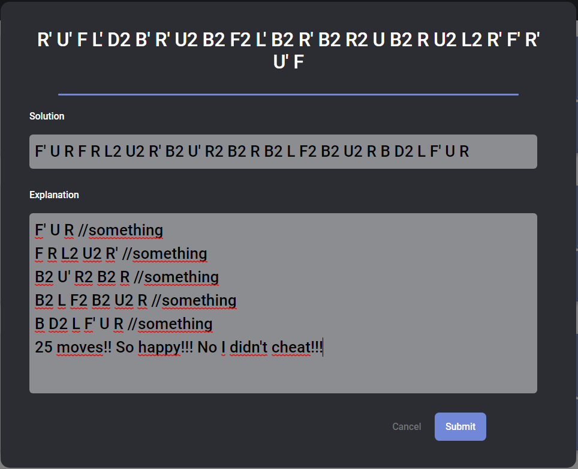
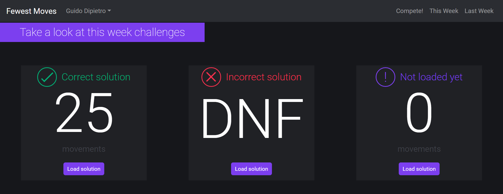
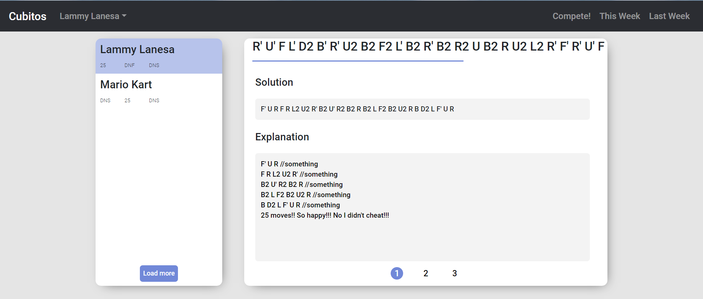
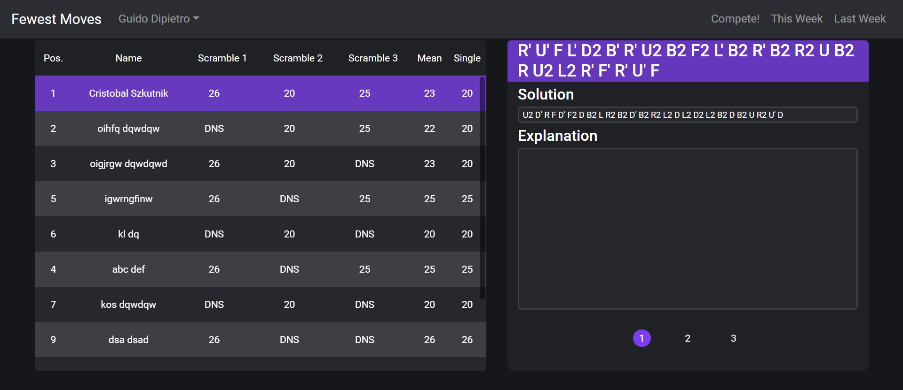

Client-side code of the web-based Rubik's Cube unofficial weekly competition that runs in the Facebook FMC group.

--

## Usage

#### "Compete!" tab

Log in or create an account to view the dashboard.  
You will see 3 scrambles, which make up the current week's contest, as shown:  

Click on the button next to each scramble to open the submission panel:  

You should submit your solution and explanation in the input fields, as follows:  

Your solution will be graded according to [official WCA regulations](https://www.worldcubeassociation.org/regulations/#article-E-fewest-moves). The dashboard will change its color, signaling the validity of your submissions.  

#### This Week

You can view the solutions of the ongoing contest, to your own risk of spoilers. Since this contest is unofficial and solely intented for practice purposes, every solution becomes public as soon as it is submitted.  

#### Last Week

Here you can check the rankings for the results of the previous week. Yeah, nice names. They are sorted following official indications: double sort by mean, then by single.  

## Enjoy.
