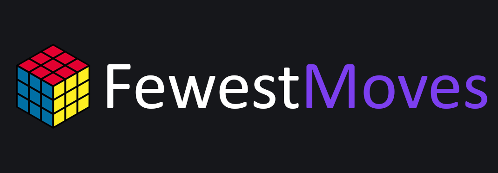

## About the contest

The contest runs from Sunday to Sunday. Every week three scrambles are automatically generated. The participants have one hour for each scramble and they can start the attempt whenever they want. After one hour the solution is automatically sent and modifications are no longer possible. However, the explanation of the solution can still be modified.  
At the end of the week all responses are rated based on how many of the three scrambles they solved, their mean and the solution with the fewest moves.

## Contributing
This project was made with no intention but to learn and improve our rubik's cube solving skills. Constructive criticism and contributions are welcomed. Recomendations, enhancements and bugs can be posted as issues on this repository.
